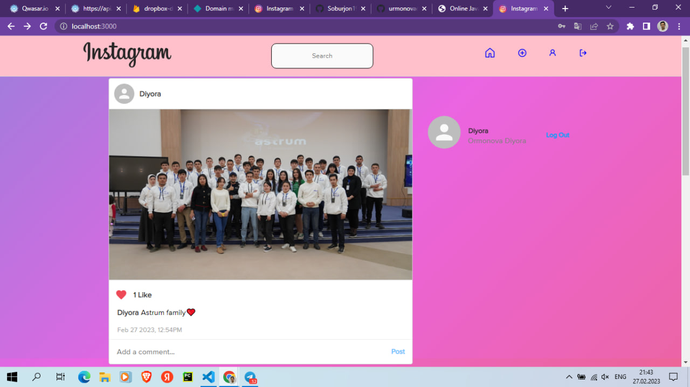
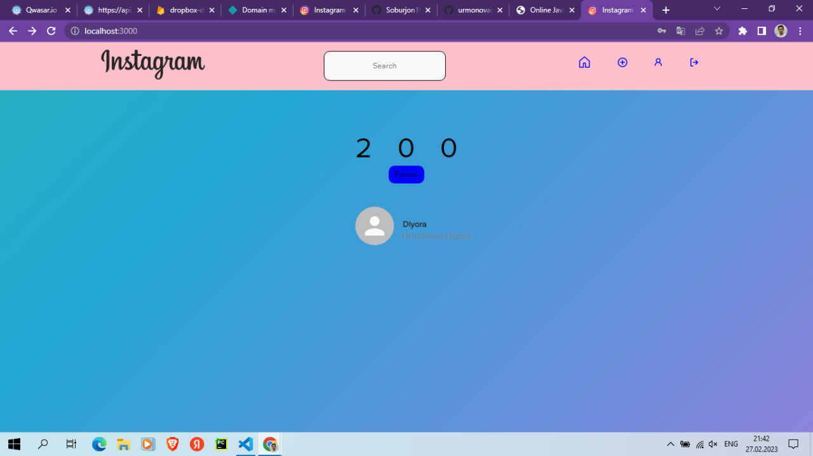
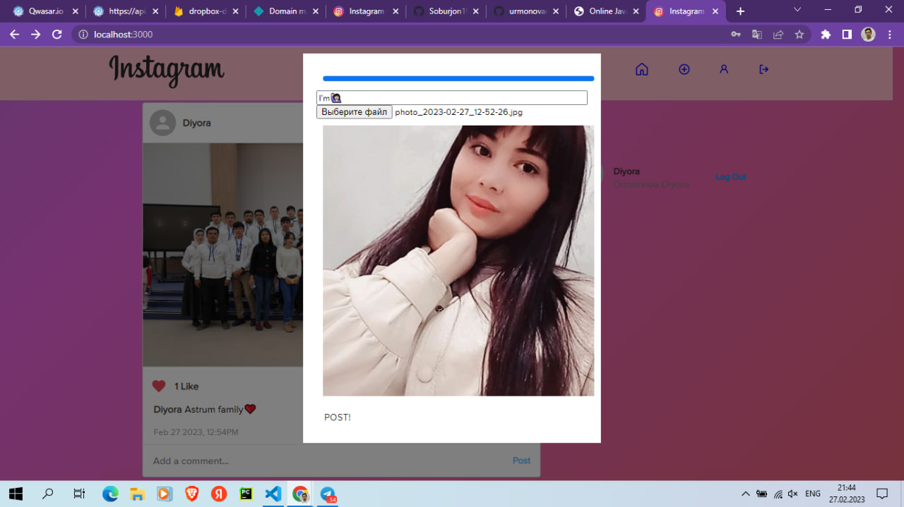
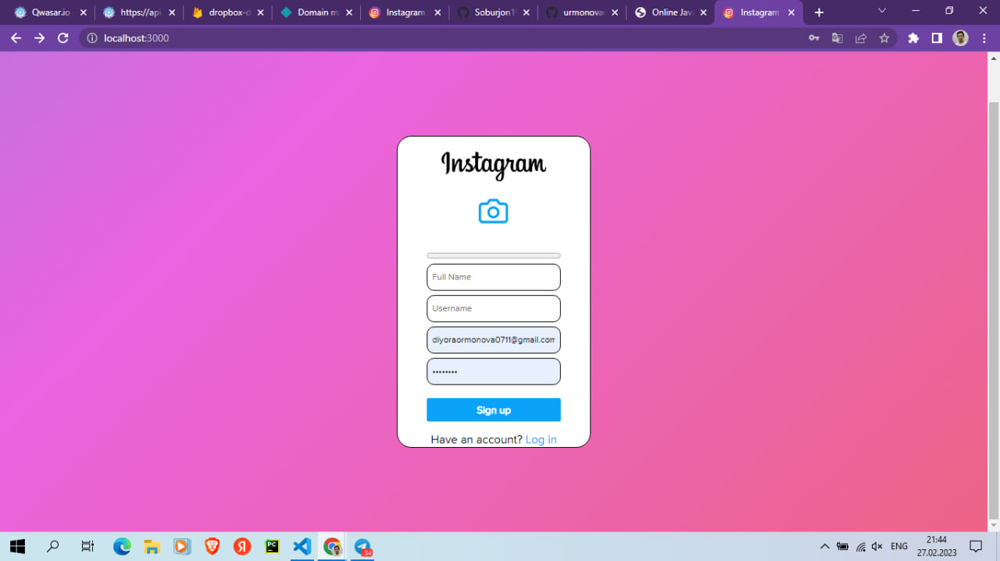
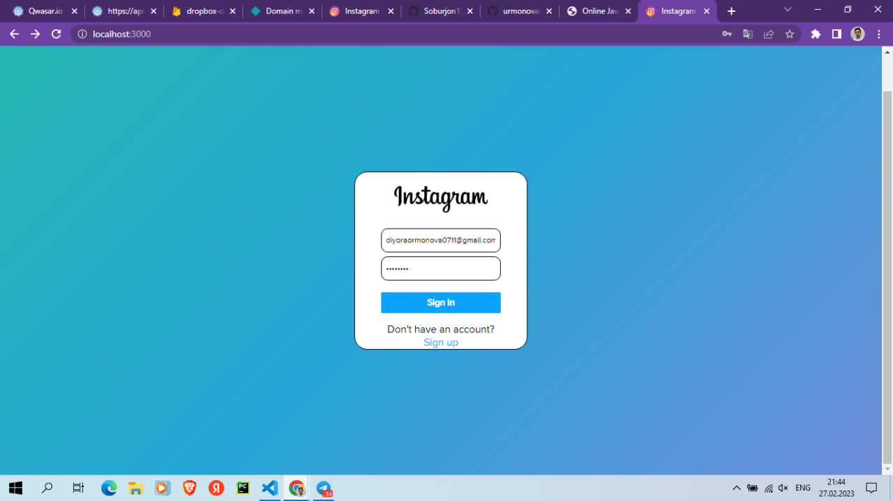

# Welcome Instagram
Welcome to my project <a href="https://diyora-instagram.netlify.app/">Instagram</a>

## Usage

- Diyora [@urmonovadiyora](https://github.com/urmonovadiyora)

## Demo
https://diyora-instagram.netlify.app/

## Task 
- Login, Signup.
- Follow, Unfollow.
- Like, Comment.
- Post Text, Image.
- Time ago format used everywhere.
- Shows images in Theatre mode.
- ...

## Installation
first you need install node. For install you need write in terminal
```
npm i
```
and write for run
```
npm start
```

## Description
This project is about creating a clone of Instagram.

# Instagram Photos







### The Core Team
O'rmonova Diyora urmonova_d

<span><i>Made at <a href='https://qwasar.io'>Qwasar SV -- Software Engineering School</a></i></span>
<span></span>
